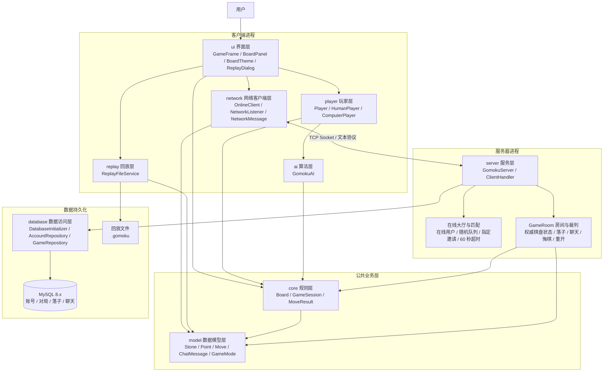
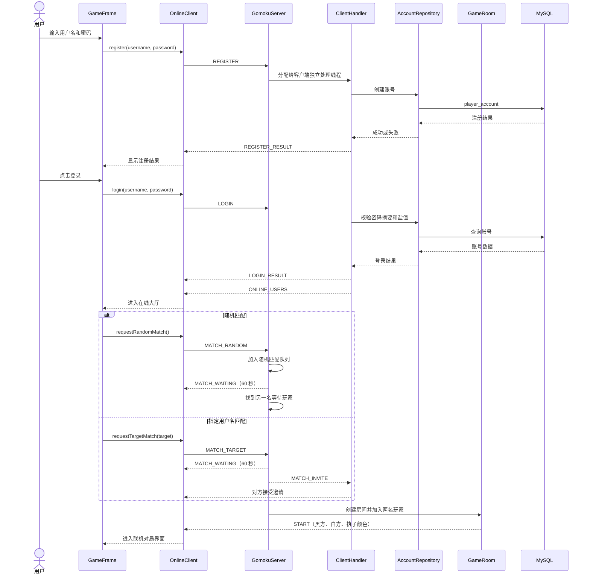
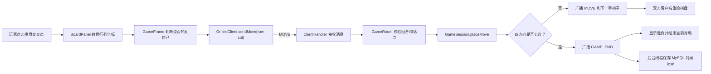
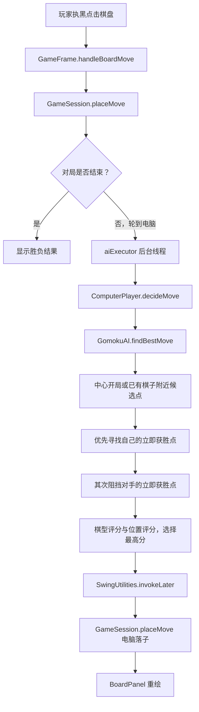

# 网络五子棋功能架构图

本文档用 Mermaid 描述项目的功能分层、联机匹配流程和人机对战流程。Mermaid
代码可以在支持 Mermaid 的 Markdown 预览器中直接渲染，也可以复制到
Mermaid Live Editor 中查看。

## 一、系统功能总览

## 二、联机注册、登录与匹配流程

## 三、联机对局数据流

服务器是联机对局的权威状态来源。客户端只发送请求，不能直接决定棋局结果；
`GameRoom` 校验回合、坐标和当前房间状态后，再由 `GameSession` 更新棋盘并广播。

## 四、人机对战流程

`GomokuAI` 使用评分表法，不进行深度极大的极小极大搜索。它先把四个方向上的
局部棋型转换为字符串，再根据五连、活四、冲四、活三等棋型设置分值。人机计算
放在后台线程中，结果回到 Swing EDT 后再更新棋盘，避免界面卡顿。

## 五、功能与技术对应关系

| 功能 | 主要实现位置 | 说明 |
| --- | --- | --- |
| 15×15 棋盘和鼠标落子 | `ui.BoardPanel`、`ui.GameFrame` | Java2D 绘制棋盘和棋子，鼠标坐标转换为行列 |
| 胜负判断 | `core.Board`、`core.GameSession` | 横向、纵向、正斜、反斜四方向查找连续五子 |
| 本地双人 | `ui.GameFrame`、`core.GameSession` | 同一进程内轮流落子 |
| 人机对战 | `player.ComputerPlayer`、`ai.GomokuAI` | 后台线程调用评分表 AI |
| 注册和登录 | `database.AccountRepository`、`server.ClientHandler` | 密码使用盐值和摘要保存 |
| 在线大厅 | `server.GomokuServer`、`network.OnlineClient` | 维护在线用户列表并实时广播 |
| 随机匹配 | `GomokuServer.requestRandomMatch` | 等待队列配对，超时时间 60 秒 |
| 指定用户匹配 | `GomokuServer.requestTargetMatch` | 按用户名发送邀请，对方同意后开局 |
| 联机落子 | `server.GameRoom`、`network.OnlineClient` | 服务器权威校验并广播结果 |
| 聊天 | `GameRoom.handleChat`、`OnlineClient.dispatch` | 房间内消息实时转发 |
| 悔棋 | `GameRoom`、`core.GameSession.undoLastMove` | 对方同意后回退一步 |
| 重新开始 | `GameRoom.handleRestartRequest` | 双方确认后重置房间棋局 |
| 游戏回放 | `replay.ReplayFileService`、`ui.ReplayDialog` | 保存 `.gomoku` 文件并逐步播放 |
| MySQL 初始化 | `database.DatabaseInitializer` | 启动时执行 `sql/init.sql` |
| 对局存档 | `database.GameRepository` | 保存对局、落子和聊天记录 |
| 棋盘换肤 | `ui.BoardTheme`、`ui.BoardPanel` | 切换原木、青玉、海蓝主题 |
| 清屏动画 | `ui.BoardPanel`、`ui.GameFrame` | 使用 Swing 计时器播放扫光效果 |

## 六、线程模型

| 线程或线程池 | 归属 | 作用 |
| --- | --- | --- |
| Swing EDT | 客户端 | 处理按钮、鼠标、棋盘重绘和弹窗 |
| `aiExecutor` | 客户端 | 后台执行 AI 搜索，避免阻塞界面 |
| `OnlineClient` 读取线程 | 客户端 | 持续读取服务器消息并回调 `NetworkListener` |
| 服务器接受连接线程 | 服务端 | 循环执行 `ServerSocket.accept()` |
| `ClientHandler` 处理线程 | 服务端 | 每个客户端连接一个读消息线程 |
| `gomoku-match-timer` | 服务端 | 处理 60 秒匹配超时和取消 |
| `gomoku-room-save` | 服务端 | 对局结束后异步写入 MySQL |

## 七、包职责简表

| 包名 | 职责 |
| --- | --- |
| `io.github.tissyboxc.gomoku.ui` | Swing 窗口、棋盘绘制、主题、回放窗口和事件处理 |
| `io.github.tissyboxc.gomoku.core` | 15×15 棋盘、落子规则、胜负判断和棋局状态 |
| `io.github.tissyboxc.gomoku.ai` | 评分表法五子棋 AI |
| `io.github.tissyboxc.gomoku.player` | 玩家抽象、人类玩家和电脑玩家 |
| `io.github.tissyboxc.gomoku.network` | TCP 客户端、网络监听接口和消息协议 |
| `io.github.tissyboxc.gomoku.server` | 服务器、客户端处理器、大厅匹配和联机房间 |
| `io.github.tissyboxc.gomoku.database` | JDBC 连接、数据库初始化和数据访问 |
| `io.github.tissyboxc.gomoku.replay` | `.gomoku` 回放文件的保存和读取 |
| `io.github.tissyboxc.gomoku.model` | 棋子、坐标、棋步、聊天和游戏模式模型 |

